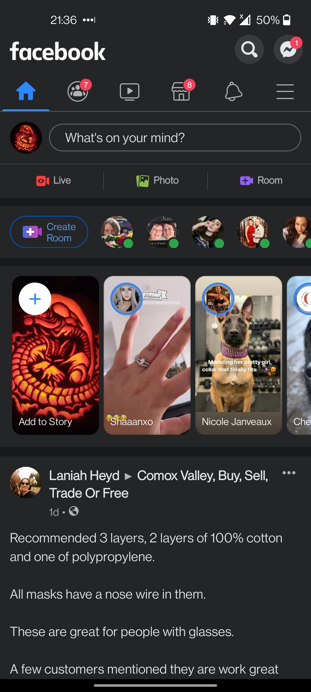
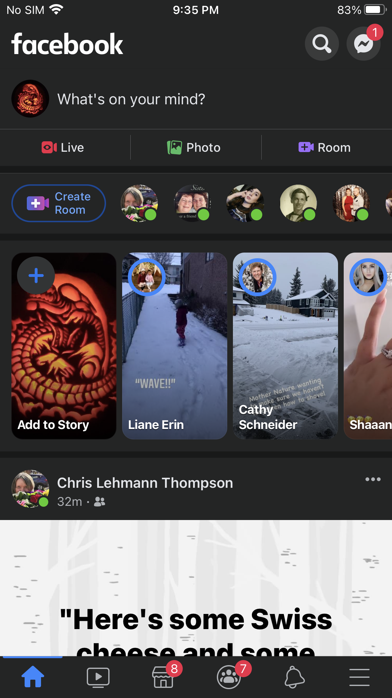
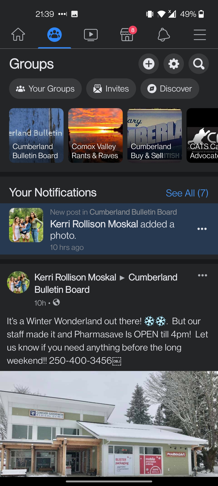
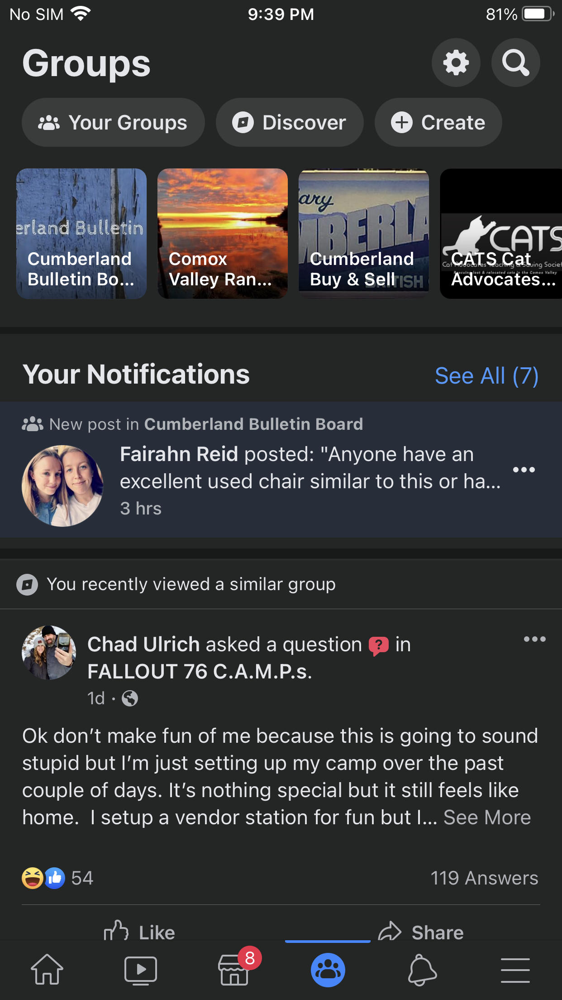
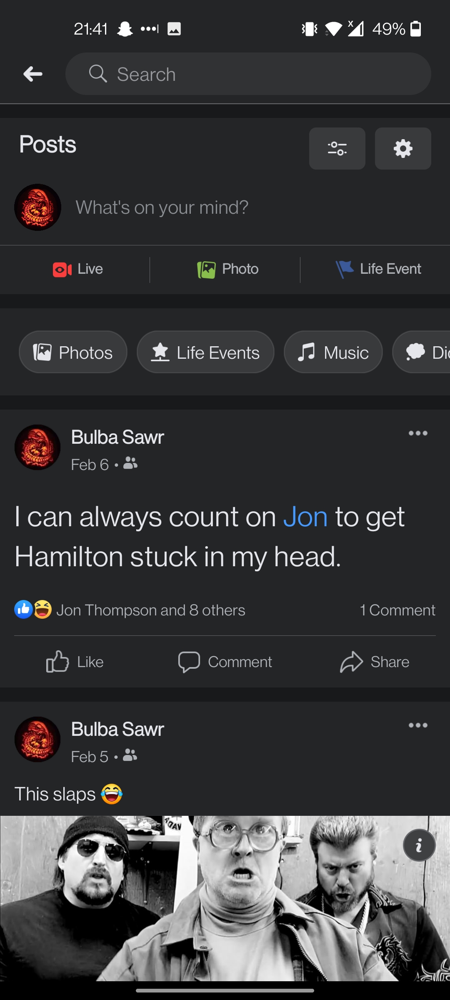
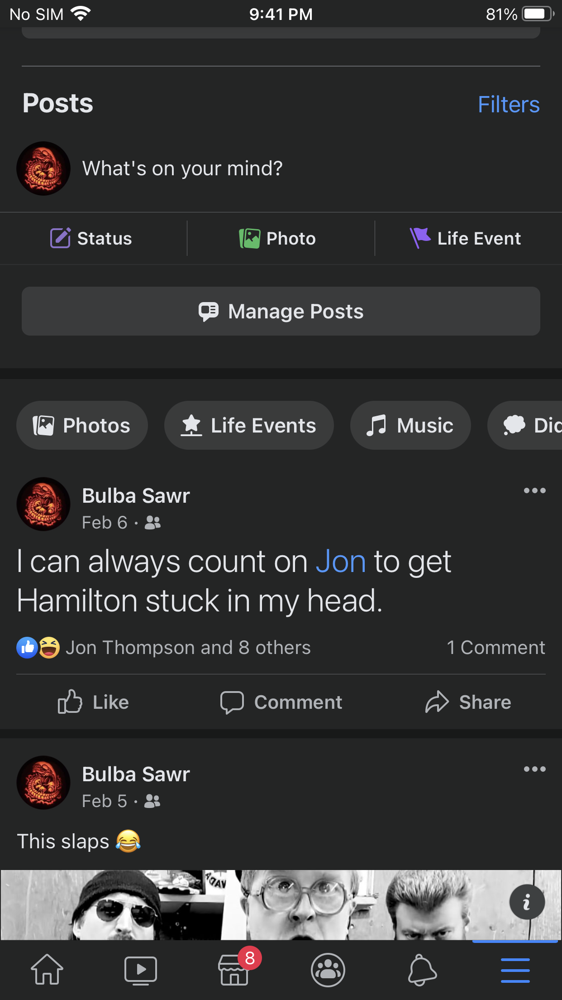
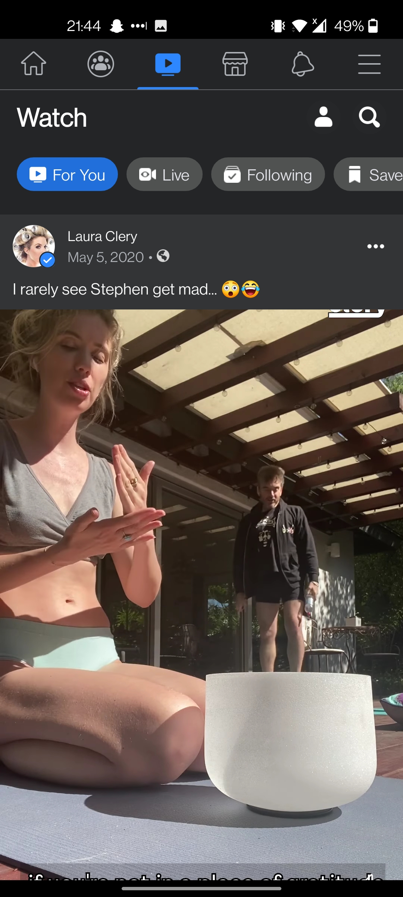

# DGL 104 Process Portfolio

## By Amanda Thompson

### Week 1

**Activity 0101**:

One of my assignments last semester was to find similarites between three games in previous assignments, decompose it into smaller methods while using polymorphism by inheritance or abstraction, and write it to one playable game. I was hung up on this one method for far too long trying to get the yes and no entries to work. I've gotten these to work no problem before and have another method just like it in one of the other games that works perfectly. But this one. Refused. I've written it many different ways by changing the syntax in the if and while conditions, flipping around the nested ifs. I think the first thing I would try again is to put the invalid entry else condition above the if statements.

```
// Roll again method to allow for player to choose if they want to play again or
	// quit.
	@Override
	public boolean rollAgain() {

		System.out.println();
		System.out.println("Roll again? y/n");

		while (true) {

			str = in.nextLine();

			// if str console input equals y, trigger corePigGame method
			if (str.equals("y")) {
				an = true;
				corePigGame();

				// if str console input equals n, trigger computer turn method method
				if (str.equals("n"))
					an = false;
				coreCompPigGame();
			} else
				System.out.println("Invalid entry. Try again.");

			return an;
		}
	}
```

**ACTIVITY 0102**:

MainGameHub.java is the class that houses the method in Activity 0101. The biggest area of improvmemt would be architectural. I would like to redesign it completely with the MVC pattern. I used an abstract class for the game root with most of the variables and constants and the one inherited class to house the rest of the methods. I think it would have been better to use a non abstract class as the root and broken up the similar methods into different child classes to keep things organized and leaned into the polymorphism a little more.
Another area for improvement is writing more informative comments. 
Another area is to work on control flow like in Activity 0101.


<br/>
<br/>

________________________________________________________________________________________________________________________

<br/>
<br/>


### Week 2

**Activity 0201**:

The app that I've chosen to assess to identify the target user base is Discord.

I believe Discord's target user base is gamers, allowing them to have consistent and versatile communication for online games in their own servers either in a community or with their friends. But it's so much more than that. With private or public servers, you can create any kind of community for anything. There's voice channels, screen sharing, video, and text chat that make it comparable to Skype and Twitch but much more customizable. I myself belong to different servers like Newegg, which is primarily about pc building but has many different channels for different topics and also includes gaming channels, another server I'm in is just with friends as well as my sister that we use for sh*tposting and organizing game nights as well as communication in game, and of course I belong to the NIC server so that I can stay in communication with my classmates. The NIC server has really been a great avenue for communication during the school year because of COVID. It allows us to get to know each other without having been able to meet each other.


<br/>
<br/>

________________________________________________________________________________________________________________________

<br/>
<br/>

**Activity 0202**:

For this activity I'm going to use MainGameHub.java included in the repo to examine variables and method names. I think that most of the variables and methods are sufficiently descriptive. I do already try not to make them too long but there's a non-zero amount of times that I can make them too short.

The first one I'll start off with is the method name tooHighLowRight(). 
I know exactly what it does but it doesn't make sense looking at it. I should have kept with the naming convention I used for the other core game methods. I even wrote above the method in a comment that it's the core game logic for HiLo. I would rename it coreHiLoGame()

```
public int tooHighLowRight() {

		do {
			enterGuess();
			if (userGuess > 0) {
				if (userGuess == number)
					System.out.println("Right!! Amount of tries: " + count);
				else if (userGuess < number)
					System.out.println("You're too low!");
				else
					System.out.println("You're too high!");
			}

		} while (userGuess != number && userGuess > 0);
		System.out.println();
		System.out.println("Play again? y/n");
		str = in.nextLine();

		if (str.equalsIgnoreCase("y")) {
			startHiLo();
			// enterGuess();
			tooHighLowRight();
		}

		return userGuess;
```

The second will be the variable 'an'. I was mostly trying to save keystrokes but it's not very clear in use even though it's explained in the comment. 

```
protected boolean an; // stores console input in an - 'answer'
```

The third will be the method name RPScon(). RPS is rock, paper, scissors but this is a good example of a bad name because I have no idea what 'con' is supposed to be. My best guess is that it's short for converter because I was assigning a numeric value to RPS and using numGenerator() to choose R, P, or S.

```
	public int RPScon(int y) {

		if (y == 1)
			compTurn = "R";
		else if (y == 2)
			compTurn = "P";
		else if (y == 3)
			compTurn = "S";

		return y;
	}
```

The forth will be the variable I assigned to the scanner. I usually leave the scanner object as 'scan' so I'm not sure why I changed it this time.

``` 
Scanner in = new Scanner(System.in);
```

And lastly, the last one I could change to make more sense at facevalue is 'count' because what is it counting? It's actually counting the turn count so that it keeps track of how many rolls the player is on to appropriately declare the user a pig if they lose and are on two or more rolls in a turn. So I guess I could call it turnCount or rollCount instead.

```
count++;
```

<br/>
<br/>

________________________________________________________________________________________________________________________

<br/>
<br/>

### Week 3

**Activity 0301**:

An app I've chosen to examine is Facebook.

The biggest layout difference is with the navigation bars. In Android, it's at the top and on iPhone, it's on the bottom. The icons are also in a different order.

In the groups page, there's a slightly different button layout at the top of the page. The biggest difference is that the create option is a smaller FAB icon above the buttons on Android and on iPhone, it's part of the tab navigation also with the text 'Create' on it.

On the profile page, a clear difference is the manage posts button and the filter button are icons above the new post section in Android and on iPhone they're in text above and below.

The Watch page has the tab buttons in a different order.

Android | iPhone
------- | -------
 | 
 | 
 | 
 | 

<br/>
<br/>

***

<br/>
<br/>


**Activity 0302**:

The documentation I've chosen to write about is on images and graphics on Android Developers.

This section is about drawables, vector drawables, bitmaps, colors and implementation. You can create drawables from resource images, from XML resources, create shape drawables, and use NinePatch drawables, or use vector graphics in your app.

The documentation usually starts with some sort of introductory section or preview of the further content. A lot of the articles then go right into XML syntax or how you would execute the content into code, offering both Kotlin and Java versions. Often they will also have videos for visual explanations of the concepts and syntax in action.


<br/>
<br/>

***

<br/>
<br/>

### Week 4

**Activity 0401**:

A UX pattern that I think is valuable is a one-handed pattern. Whether it's through lackadaisical habit or actually only having one free hand, an app that supports one-handed use creates efficiency and productivity with less effort. It also feels more comfortable using one hand while using an app. Being more of a one-handed phone user myself, it's way easier to browse social media or reddit whilst laying in bed at night when the app supports it. If the app requires me to keep raising my arm to advance to another screen when I'm tired, I'll be less likely to spend time on it. It's funny that we prefer the methods that have a higher chance of dropping your phone on your face just to save some time. 

<br/>
<br/>

***

<br/>
<br/>

**Acivity 0402**:

In exercise 1, I believe that the second option is the more orthogonal approach. It has the potential for reusability in case you wanted to use input from the console, etc. 

```
class Split2 {
  constructor(line)
  def getField(n)
}
```

Orthogonality relates to MVC by separating components into a data model, controller, and a view. When these components are separated by concept, it becomes easier to decouple and easier for the components to be orthogonal.

<br/>
<br/>

***

<br/>
<br/>

### Week 5

**Activity 0501**:

The main similarities between MVC, MVP, and MVVM are that they all use a model to store the data and a view to represent the model. In MVP, the Activiies are now considered part of the view and implement an interface. In MVVM, the view binds to observable variables by the ViewModel.
The major differences are in the third element of each concept. In MVC, the Controller is the middle man between the model and the view. The view tells the controller that a button was clicked and the controller interacts with the model and changes the data accordingly. In MVP, the Presenter is tied to an interface and does not directly interact with the view. In MVVM, the ViewModel has an interface and the view has the Activity.


<br/>
<br/>

***

<br/>
<br/>

**Activity 0502**:

For this activity, I'll be using GameRootAbstr.java to examine. 

I ended up using a lot of global variables for this project which were indeed unnecessary because it was just an abstract class with only one class inheriting from it. I could have just put them in the MainGameHub. I would also remove static from all of them and mark them all as private.

<br/>
<br/>

***

<br/>
<br/>

### Week 8

**Activity 0801**:

MVC, MVP, MVVM:
 * The model stores the data
 * The view represents a model
 
 The third component in all three have major differences. In MVC, The controller is the middle man between model and view. In MVP, the Presenter is tied to an interface and does not interact with the view. In MVVM, the ViewModel has the interface and the view has the activity.

The difference with MVI is that the Model in MVI represents both the state of an app and the data it holds while the model in the others just holds the data. Interfaces represent the Views that are implemented by Activities or Fragments. The Intent represents an intention or desire to perfrom an action. 
This architecture operates with a cyclical flow between the business logic, view, and presenter.

<br/>
<br/>

***

<br/>
<br/>

**Activity 0802**:

The app I'm going to use to examine resources is Gmail.
The resources I think are critical in Gmail's functionality is network, caching, battery performance and lazy loading. The app has options in the settings so that you can adjust the frequency of syncing your mail and an option to only download files over wifi. It uses lazy loading for the emails, only showing who it's from, the subject, and time of received or sent emails. When you open an email, it won't show the images unless you allow it in each email. It uses caching for the settings as well as all of the log in and password information.

<br/>
<br/>

***

<br/>
<br/>

### Week 9

**Activity 0902**:

Debugging is something I've not been the strongest on. I've definitely been guilty of, at least in the first semester, saying whatever error or mistake is impossible. I've grown to not have that mindset anymore thankfully because I know there's a lot more going that than what I currently understand. 

As I code more and more, I become familiar with the various ways of process of elimination. It's definitely the type of debugging I've always used, whether it's started off by just checking spelling and syntax or if I need to invalidate the cache. 

Rubber ducking I definitely use once in a while to my poor partner that doesn't understand at all what I'm going on about, but likes to hear it anyway.

Logging and tracing is something I'm not all that confident in using. It's something that I want to start using in the future.

<br/>
<br/>

***

<br/>
<br/>

**Activity 0903**:

I used these four steps in a previous project. It was really interesting to use because my usual method is to start changing things right away but also to read and study the code for hours. A step I can improve on is the hypothesis and writing things down so I don't forget what I've already tried. I'm sure the four step process would work on anything needing to be debugged but I don't think it would be necessary for small and glaring fixes. Unless changing the simple thing breaks the whole project.

<br/>
<br/>

***

<br/>
<br/>

### Week 10

**Activity 1001**:

For most of last semester's CPS 100, I was programming by coincidence. I was completely new to java and didn't understand how it worked nor why it worked together. I didn't really come out of that course feeling like I knew what I was doing either. It's really turned around this semester though where I find myself programming deliberately. In my last assignment for 114, I found myself wanting to add more and more features but stopped myself because the requirements were met plus additional features. 

One thing I already do when programming deliberately is prioritizing my effort. I will focus on the main components that will make the app run and then I will go back and add the bells and whistles. One thing I need to start doing is to document my assumptions and use assertions. I haven't used assertions yet but I can only imagine how valuable this tool will be.

<br/>
<br/>

***

<br/>
<br/>

**Activity 1003**:

Debugging | Testing
------ | ------
Code is already written and bugs have shown up. | Test first and write the code later.
Fixing bugs found in testing. | Finding bugs and errors.
Debugging is done by the developer. Cannot automate. | Testing can be automated as well as manually.

The pros of testing is that you can write the tests before you write the code. When you have tests written, then you know your code is done when it passes the tests. A con of testing is that it's hard. You can't write a test case for every single bug in a very large program because there could end up being 2^64 test cases.

Pros of debugging are that the end results fixes the bugs you have found. A con is that sometimes it can be difficult to consistently reproduce the bug

<br/>
<br/>

***

<br/>
<br/>

### Week 10

**Activity 1101**:

Retrofit:
The purpose of Retrofit API is to turn your HTTP API into a Java Interface. Interfaces are then turned into callable objects.

Gson:
The purpose of GSON is to be able to convert Java objects into their JSON representation. It can be used to work on pre-existing objects that you don't have source-code of, extensive support of Java Generics, allows custom representations for objects and supports arbitrarily complex objects.

EventBus:
The purpose of EventBus is to simplify communication between Activities, Fragments, Threads, Services, etc. with less code. EventBus propogates listeners for all participants and decouples event senders and receivers.

Google Pay API:
The purpose of Google Pay's API is to enable fast and simple checkouts in your app and gives access to cards saved on Google Accounts. 

BBVA API Market:
The purpose of BBVA is to offer many types of financial API's. BBVA Customers allows for the use of OAuth-based interfaces to handle information belonging to customers. Customers and Payments API both allow quick payments to be simply generated. 

<br/>
<br/>

***

<br/>
<br/>

**Activity 1102**:

Some features of VSCode that I didn't know about are:

Multi cursor selection:
* To put cursors at arbitrary positions, you position your mouse and use 	Alt+Click or Option+Click. 
* To set cursors above or below the current position, you use: Option+Command+Up or Option+Command+Down
* You can add cursors to all occurrances of the current selection using: Shift+Command+L
* To select only some occurrances of the current selection, you use: Command+D
